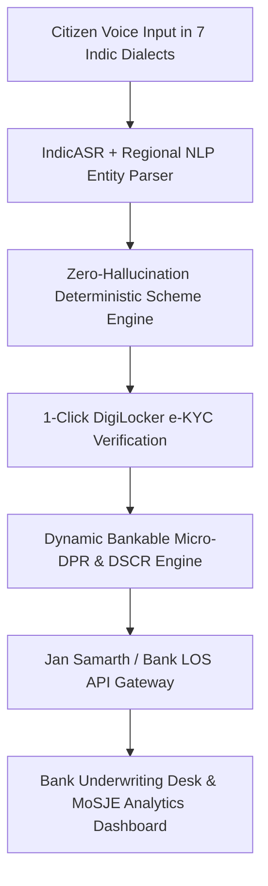

# 🇮🇳 UdyamSetu AI (उद्यमसेतु AI)
### Multilingual Voice-First Scheme Discovery & Automated Micro-DPR Engine
**Smart India Hackathon (SIH 2026)** | **Problem Statement ID:** `SIH26092`  
**Ministry:** Ministry of Social Justice and Empowerment (MoSJE)  
**Theme:** Smart Automation | **Category:** Software  
**Team:** Code Catalyst (1st Year Engineering Team)

---

## 🌟 Executive Summary
Over **63 Million MSMEs** in India face a **₹25 Lakh Crore credit deficit**. While government schemes like **NSFDC, NBCFDC, Stand-Up India, and PMEGP/Mudra** offer substantial subsidies and concessional credit, marginal entrepreneurs (SC, OBC, Women, rural artisans) struggle with complex paperwork, English-only interfaces, and the inability to compile bankable Detailed Project Reports (DPR).

**UdyamSetu AI** solves this with an end-to-end multi-portal ecosystem:
1. **🎙️ Citizen Multilingual Voice Portal:** Speak in 7 regional Indic dialects (Hindi, Bhojpuri, Marathi, Tamil, Bengali, Telugu, English) to instantly discover exact eligible schemes with **100% zero-hallucination deterministic matching**.
2. **📑 Automated Bank-Grade Micro-DPR Generator:** Instantly calculates CapEx machinery itemization, OpEx, net cash flows, and certified **Debt Service Coverage Ratio (DSCR ≥ 1.5x)** in a 1-page printable bankable dossier.
3. **🔗 1-Click DigiLocker e-KYC:** Automatically pulls verified identity & caste credentials with SHA-256 HMAC cryptographic signatures and on-device OpenCV blur pre-flight.
4. **🏦 Bank & State SCA Underwriting Desk:** Real-time loan queue for branch managers with 1-click underwriting and RBI Priority Sector Lending (PSL) quota tracking.
5. **📊 MoSJE Ministry Analytics Dashboard:** Real-time national disbursement telemetry, caste-wise equity distribution, and state ranking leaderboards.

---

## 🚀 Live Demo & Deployment

- **Live Production URL:** [https://udyamsetu-ai.vercel.app](https://udyamsetu-ai.vercel.app)
- **Local / Offline Usage:** Simply open `index.html` in any modern web browser.

---

## 🛠️ Architecture & Tech Stack

- **Frontend & UI:** HTML5, CSS3, Modern Glassmorphism Tailwind-compatible responsive design, Chart.js / SVG data visualizations.
- **Voice & Indic Speech:** Web Speech API / IndicASR, Dynamic canvas audio waveform visualizer.
- **Intelligence Layer:** Client-side deterministic statutory rules matrix (NSFDC, NBCFDC, Stand-Up India, PMEGP, Mudra) with dynamic entity extraction.
- **Financial Computation:** Automated CapEx/OpEx cash flow modeling, calibrated Debt Service Coverage Ratio ($DSCR = \frac{\text{Net Operating Income}}{\text{Total Debt Service}}$).
- **Compliance & Security:** DigiLocker API mock, OpenCV Laplacian blur check, SHA-256 HMAC cryptographic tamper sealing, RBI Priority Sector Lending (PSL) alignment.

---

## 📁 Repository Contents

| File | Description |
| :--- | :--- |
| `index.html` | Complete, standalone production web application (Citizen Voice Portal, Bank Desk, Ministry Dashboard, Scheme Catalog) |
| `vercel.json` | Vercel deployment and routing configuration |
| `netlify.toml` | Netlify deployment configuration |
| `SIH26092_AI_Scheme_Matching.pptx` | Official SIH 2026 Presentation Pitch Deck |
| `SIH26092_AI_Scheme_Matching_Rendered.pdf` | Rendered PDF version of the presentation slides |
| `live_demo_qr.png` | Live Production Demo QR Code for mobile scanning |
| `README.md` | Project documentation and architecture blueprint |
| `.gitignore` | Git ignore rules |

---

## 👥 Team Code Catalyst
- **Problem Statement ID:** `SIH26092`
- **Institution:** Smart India Hackathon (SIH 2026)
- **Status:** Cleared College Internals $\rightarrow$ Advancing to Institute-Level Evaluation Round

---
*Built with ❤️ by Team Code Catalyst for Smart India Hackathon 2026.*
