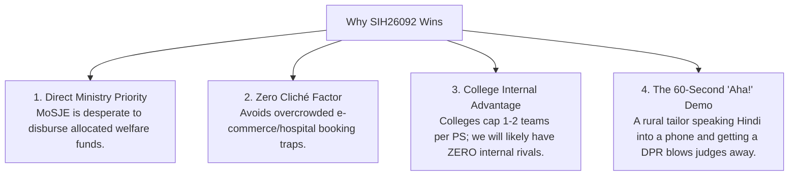

# UdyamSetu AI: Master Project Blueprint & Team Briefing Guide
**Problem Statement ID:** SIH26092  
**Problem Statement Title:** AI-Driven Scheme Matching for Marginalized Entrepreneurs  
**Sponsoring Ministry:** Ministry of Social Justice and Empowerment (MoSJE)  
**Theme:** Smart Automation | **Category:** Software  
**Target Beneficiaries:** SC/ST/OBC and Marginalized Micro-Entrepreneurs (Family Income ≤ ₹5.00 Lakhs)

---

## 1. Executive Summary: The Core Mission
The Government of India allocates thousands of crores under the Ministry of Social Justice and Empowerment (MoSJE) and apex corporations (NSFDC, NBCFDC, Stand-Up India) offering loans up to 90% of project costs at concessional 4%–6% interest rates with 25%–35% capital subsidies.

Yet, over **60% of eligible rural and marginalized artisans, tailors, cobblers, and small shopkeepers never receive these benefits**. 

**Why?** 
Not because the schemes don't exist, but because low-literacy beneficiaries cannot read 50-page bureaucratic guidelines, cannot prepare bank-mandated **Detailed Project Reports (DPRs)**, and face a **40%+ rejection rate at bank branches** due to minor document mismatches and missing paperwork.

**Our Solution (UdyamSetu AI):**  
A voice-first vernacular AI platform where an entrepreneur can speak in their mother tongue (Hindi, Tamil, Marathi, etc.), get matched with the exact high-subsidy scheme, have their documents pre-checked for errors, and automatically receive a bank-grade 1-page financial Detailed Project Report (DPR) to submit for instant processing.

---

## 2. Why This is Our Winning Bet (Strategic Hackathon Edge)

1. **High National & Social Relevance:** MoSJE is an apex central ministry actively measured on fund utilization. Judges love projects that demonstrate tangible social justice and direct economic impact.
2. **Low Internal Competition (The Quota Advantage):** Under SIH rules, colleges can nominate only a limited number of teams per problem statement (typically 1–2). While 10–15 teams in your college will fight over generic agriculture marketplaces or student study apps, your team will likely be the **sole contenders** for this statement.
3. **The "Unfair" Demo Advantage:** Most teams present boring databases or plain text forms. When your team shows a live voice assistant speaking Hindi with animated audio waveforms, instant NLP entity extraction, and auto-generated financial charts, the judges are hooked within 30 seconds.

---

## 3. Why This is 100% Doable for 1st-Year Beginners

As first-year students, it is completely natural to feel imposter syndrome. Here is why this project is technically manageable:

| What Beginners Think is Required ❌ | What is Actually Required in Modern Engineering ✔️ |
| :--- | :--- |
| Writing complex Machine Learning models and neural networks from scratch. | Using pre-trained, battle-tested open-source APIs like **Bhashini / Web Speech API** for voice and **Gemini / OpenAI API** for language processing. |
| Buying expensive servers and hardware. | Running a lightweight **React / Next.js** frontend with a **FastAPI / Node.js** backend on your local laptop for free. |
| Having official UIDAI biometric enterprise licenses. | Simulating standard **DigiLocker / UIDAI Sandbox authentication** (the standard industry practice for PoCs). |
| Writing 10,000 lines of complex financial algorithms. | A deterministic unit-economics script that calculates simple CapEx + OpEx formulas for small businesses. |

> **Key Takeaway for the Team:**  
> We do NOT have to reinvent the wheel. We are system architects integrating existing world-class AI models with a clever, human-centered UI that solves a real administrative problem.

---

## 4. The 4 Ground Bottlenecks We Are Solving

To speak like domain experts in front of college professors, our team must understand the 4 real bottlenecks on the ground:

1. **The Language & Literacy Barrier:** Existing government portals (`myscheme.gov.in`, `jansamarth.in`) require reading and typing in complex formal English or formal Hindi. Rural entrepreneurs communicate orally in dialects.
2. **The "Detailed Project Report" (DPR) Wall (The Biggest Industry Secret):** Banks will not approve any commercial loan without a cash-flow statement and debt-service ratio (DSCR). An illiterate cobbler or tailor cannot make an Excel financial projection and gets turned away by branch managers.
3. **The 40%+ Document Defect Rejection Rate:** Over 50% of applications submitted online fail because of trivial errors: spelling variations between Aadhaar and Caste certificates, or income certificates that expired 3 months ago.
4. **The Missing Document Dead-End:** When an applicant lacks a caste certificate or Udyam registration, current portals just say "Not Eligible" and reject them. Nobody tells them how or where to get the certificate.

---

## 5. The Solution Architecture: UdyamSetu AI

```mermaid
graph LR
    subgraph Frontend["User Interface (Responsive PWA)"]
        UI1["1. Aadhaar Sandbox Login"]
        UI2["2. Bhashini Vernacular Voice Agent"]
        UI3["3. Scheme Match & Comparison Cards"]
        UI4["4. Pre-Flight Doc Scanner & Missing Doc Guide"]
        UI5["5. Automated 1-Page Micro-DPR"]
        UI6["6. Live Application Tracking Dashboard"]
    end
    
    subgraph Backend["AI & Logic Core (Python FastAPI)"]
        API1["NLP Entity Extractor (Trade, Income, Caste)"]
        API2["Deterministic Scheme Rule Engine (No Hallucination)"]
        API3["OCR Document Cross-Verifier (Tesseract)"]
        API4["DPR Unit Economics Generator"]
        API5["PDF Form Auto-Filler"]
    end

    Frontend <--> Backend
```

### The 4 Differentiating Features:
1. **Voice-First Vernacular Interaction:** Speech-to-text in 12+ Indian languages using Bhashini models.
2. **AI Pre-Flight Document Verifier:** OCR scans uploaded images, identifies discrepancies, and provides a "Readiness Score" before bank submission.
3. **Automated Micro-DPR Generator:** Instantly calculates equipment costs, monthly revenue, operational costs, and loan repayment capability for 20+ standard rural trades.
4. **Missing Document Resolver:** Replaces dead-end rejections with actionable 1-2-3 guides on getting missing certificates from the nearest CSC/Tehsil.

---

## 6. Project Scope: What We Build Now vs. Future Scope

To prevent team burnout, we establish clear scope boundaries:

### In Scope for College Internal Hackathon / MVP:
* **Curated Dataset of 5 Major Schemes:** NSFDC Micro-Credit, NBCFDC Term Loan, PM SVANidhi, PMEGP, PM Mudra Yojana.
* **Interactive Frontend Prototype:** 6 complete screens demonstrating the entire citizen lifecycle (Login → Voice → Matching → Doc Check → Auto-DPR → Tracking).
* **Simulated Sandbox Auth:** Realistic DigiLocker / Aadhaar OTP login modal.
* **Live Voice Demo:** Working voice recognition that captures trade, income, and category.
* **Working Micro-DPR Engine:** Real-time generation of a 1-page financial projection table for common trades (Tailoring, Carpentry, Grocery, Mobile Repair).

### Out of Scope (Saved for National Grand Finale):
* Live production UIDAI biometric hardware scanners.
* Direct integration with core banking servers of 30+ public sector banks.
* Full legal document drafting in all 22 official Indian languages.

---

## 7. 6-Member Team Role Division Matrix

| Team Member | Designated Role | Exact Responsibilities | Primary Skills / Tools |
| :--- | :--- | :--- | :--- |
| **Member 1 (You)** | **Team Lead & System Architect** | • Overall project roadmap and coordination. • Polishing PPT slides & script. • Pitching the 5-min presentation & handling judge Q&A. | Slides, Product Narrative, System Integration. |
| **Member 2** | **Frontend Engineer (UI/UX)** | • Responsive web interface using React/Next.js or HTML/Tailwind. • Building the Scheme Comparison Cards & Stepper Navigation. • Application Tracking Dashboard. | HTML5, Tailwind CSS, React/Next.js, Lucide Icons. |
| **Member 3** | **AI & Voice Engineer** | • Integrating Voice Speech-to-Text (Web Speech API / Bhashini). • Conversational prompt engineering for extracting user details. • Scheme matching logic (filtering rules by caste, income, and trade). | Python, LangChain / Gemini API, Web Speech API. |
| **Member 4** | **Backend & DPR Automation** | • REST API endpoints connecting Frontend with data. • Micro-DPR generation logic (calculating CapEx, OpEx, DSCR). • Automated PDF pre-filling service. | Python (FastAPI) or Node.js, `reportlab` / `pdf-lib`. |
| **Member 5** | **Document Intelligence & OCR** | • File upload handler for Aadhaar, PAN, and certificates. • Basic OCR text extraction (checking name spelling and expiration dates). • "Missing Document Help" modal content. | Python Tesseract OCR / EasyOCR, JavaScript. |
| **Member 6** | **Scheme Policy & Research Lead** | • Curating official MoSJE guidelines and subsidy percentages. • Preparing financial unit economics for 5 sample trades (tailor, kirana, welder). • Assisting with PPT content and anticipating judge grilling. | Government Portals (`myscheme.gov.in`, `nsfdc.nic.in`), Research. |

---

## 8. Team Lead Speaking Script (Word-for-Word Meeting Script)

*Use this script when you open tomorrow's team meeting:*

> "Hey everyone! Thanks for gathering. Today, we are officially locking in our problem statement for SIH 2026: **SIH26092 — AI-Driven Scheme Matching for Marginalized Entrepreneurs**, sponsored by the **Ministry of Social Justice and Empowerment (MoSJE)**.
> 
> Before anyone worries about whether we know enough coding as first-years, let me give you the big picture: **This is the single most strategic and winnable problem statement for our team.**
> 
> In our college internal hackathon, 80% of senior teams will build the same old generic ideas: e-commerce for farmers, hospital appointment bots, or generic complaint portals. Judges get bored seeing 15 versions of the same thing.
> 
> Under SIH rules, colleges can only nominate 1 or 2 teams per problem statement. Because we picked this specialized Ministry problem, **we will likely have zero internal competition in our college.**
> 
> Furthermore, we are not building just another chatbot. The real tragedy in India is that the government has thousands of crores allocated for SC/ST and backward class entrepreneurs with up to 90% loan coverage, but over 40% of them get rejected by banks because they don't know how to make a financial business plan (DPR) or their documents have minor spelling errors.
> 
> Our project, **UdyamSetu AI**, solves this through 4 beginner-friendly capabilities:
> 1. A rural artisan can speak in Hindi or regional language instead of typing.
> 2. The AI matches them with the highest subsidy scheme without hallucinating.
> 3. Our pre-flight scanner catches missing or expired certificates before bank rejection.
> 4. Our system automatically generates a 1-page bankable Detailed Project Report (DPR).
> 
> We already have the complete 6-slide SIH PPT outline and an interactive live prototype to demonstrate this exact journey. 
> 
> I have broken down the work into 6 distinct roles so everyone has a manageable piece to own, regardless of your current coding experience. We build together, we learn together, and we walk into the internal hackathon with a presentation that will stand out from every other team in our batch. Let's make this our winning project!"
